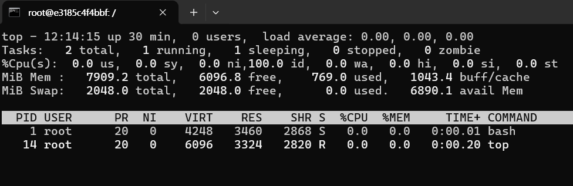

# 리눅스 명령어 - top, ps, jobs, kill

## top

top 명령어는 리눅스 시스템에서 실시간으로 시스템의 성능을 모니터링하는 데 사용된다 
top은 CPU 사용량, 메모리 사용량, 프로세스 정보 등을 포함한 시스템의 다양한 성능 지표를 실시간으로 보여준다.
이 명령어는 시스템 관리자와 사용자에게 현재 시스템의 상태를 이해하고 성능 문제를 식별하는 데 사용할 수 있다.

### 기본적인 사용법
터미널에 top 을 입력하면 된다.

```bash
top
```

명령어가 실행되면 다음과 같은 상태가 된다.



top 명령어를 입력하면 다음과 같은 정보가 표시된다.
#### 1. 시스템 정보
현재 시간, 시스템 가동 시간, 사용자 수, 평균 부하를 표시한다.
#### 2. 프로세스 정보
실행중인 프로세스의 수,  멈춘 프로세스 수, 좀비 프로세스 수를 표시한다.
#### 3. CPU 상태
CPU 사용률을 사용자 모드(user mode), 시스템 모드(system mode), 나이스 모드(nice mode), 대기 모드(idle mode), IO 대기 모드(I/O wait), 하드웨어 인터럽트(hardware interrupt), 소프트웨어 인터럽트(software interrupt)로 구분하여 보여준다.
#### 4. 메모리 상태
전체 메모리 용량, 사용중인 메모리, 여유 메모리, 버퍼 및 캐시 메모리를 표시한다.
#### 5. 스왑 메모리 상태
스왑 메모리는 실제 메모리가 가득 찼지만 더 많은 메모리가 필요할 때, 디스크 공간을 이용하여 부족한 메모리를 대체할 수 있는 공간을 의미한다.

전체 스왑 용량, 사용 중인 스왑, 여유 스왑 등을 보여준다.
#### 6. 프로세스 목록
PID(프로세스 ID), 사용자 이름, 우선 순위, nice 값, 메모리 사용량, CPU 사용률, 실행 시간, 명령어 등을 포함하여 각 프로세스의 정보를 나열한다.

### 단축키
top 명령어가 실행되고 있는 화면에서, 다음과 같은 단축키를 사용할 수 있다.
* **h** : 도움말을 표시한다.
* **q** : 명령어를 종료한다.
* **k** : 특정 프로세스를 종료한다. PID를 입력하고 시그널을 지정한다.
* **r** : 특정 프로세스의 우선순위를 변경한다. PID와 nice값을 입력한다.
* **s** : 화면 갱신 주기를 변경한다.
* **P** : CPU 사용률 순서로 프로세스를 정렬한다.
* **M** : PID 순서로 프로세스를 정렬한다.
* **T** : 실행 시간 순서로 프로세스를 정렬한다.

### 명령어 옵션
명령어를 실행할 때 옵션을 사용할 수 있다. 이하는 몇 가지 주요 옵션이다.

* **-d <딜레이>** : 갱신 주기를 <딜레이>초 만큼으로 설정한다.
* **-p <PID>** : 특정 PID의 프로세스를 모니터링한다.
* **-u <유저>** : 특정 사용자의 프로세스만 표시한다.
* **-n <숫자>** : 지정된 수의 업데이트 후 종료한다.

2초마다 갱신하고 PID가 1234인 프로세스를 모니터링 하려면 다음과 같이 실행할 수 있다.
```bash
top -d 2 -p 1234
```
## ps
ps 명령어는 리눅스 시스템에서 현재 실행중인 프로세스의 상태를 확인하는데 사용된다.
ps는 **process status**의 약자로, 시스템에서 실행중인 프로세스의 목록과 해당 프로세스의 정보를 출력한다.
ps 명령어는 다양한 옵션을 제공하여 프로세스 정보를 원하는 형식으로 표시할 수 있다.

### 기본적인 사용법
터미널에 ps라고 입력하면 실행 중인 프로세스 목록을 간단히 볼 수 있다.
```bash
ps
```

기본 출력에는 다음과 같은 정보가 표시된다.

* **PID** (프로세스 ID)
* **TTY** (터미널)
* **TIME** (CPU 시간)
* **CMD** (명령어)

### 주요 옵션
명령어를 실행할 때 옵션을 사용할 수 있다. 이하는 몇 가지 주요 옵션이다.

* **-e** : 또는 **-A** : 시스템의 모든 프로세스를 표시한다.
* **-f** : 풀 포맷으로 출력한다. 사용자, PID, PPID, 시작 시간, CPU 사용 시간, 명령어 등을 포함한다.
* **-u <유저>** : 특정 사용자의 프로세스를 표시한다.
* **-p <PID>** : 특정 PID의 프로세스를 표시한다.
* **-o <포맷>** : 사용자가 정의한 출력 형식을 이용한다 예)
```bash
ps -o pid,user,%cpu,%mem,cmd
```

### 기타
특정 프로세스를 찾기 위해 리다이렉션을 이용해 grep 등과 같이 사용할 수 있다.

예를 들어 **'apache'** 라는 이름이 포함된 프로세스를 찾으려면 다음과 같이 할 수 있다.
```bash
ps -ef | grep apache
```

ps 명령어의 출력은 실행 시점의 스냅샷이며, 실시간 정보가 아니다.

실시간으로 갱신되는 정보를 원한다면 top을 이용하는 것이 더 낫다.
## jobs
jobs 명령어는 리눅스 시스템에서 현재 셸 세션에서 실행 중이거나 중지된 작업 목록을 표시하는 명령어이다. 이 명령어는 백그라운드 작업 및 일시 정지된 작업을 관리하는 데 사용할 수 있다.

### 기본적인 사용법
터미널에 jobs 를 입력하면 현재 셸에서 실행 중인 모든 작업을 나열한다.

```bash
jobs
```

각 작업에 대한 작업 상태는 다음과 같은 상태로 표시된다.

* **Running** : 작업이 백그라운드에서 실행중.
* **Stopped** : 작업이 일시 중지된 상태.
* **Done** : 작업이 완료된 경우.
* **Exit <code>** : 작업이 종료 코드 **<code>** 와 함께 종료된 경우.

### 주요 옵션
명령어를 실행할 때 옵션을 사용할 수 있다. 이하는 몇 가지 주요 옵션이다.

* **-l** (long format) : 각 작업에 대한 PID를 포함한 자세한 정보를 출력한다.
* **-n** (newly changed status) : 상태가 변경된 작업만 표시한다.
* **-p** (process IDs) : 각 작업의 PID만 출력한다.

## kill
kill 명령어는 리눅스 시스템에 프로세스에 신호를 보내는 데 사용한다. 주로 프로세스를 종료하거나 특정 작업을 수행하도록 신호를 보낼 때 사용된다. kill 명령어는 프로세스 ID(PID)를 기반으로 동작한다.

### 기본적인 사용법
```bash
kill <옵션> <PID>
```
### 주요 옵션
kill 명령어는 여러 가지 신호를 보낼 수 있다.

* **-SIGTERM** 또는 **-15**(기본값) : 종료 신호. 프로세스를 정상적으로 종료한다.
* **-SIGKILL** 또는 **-9** : 강제 종료 신호. 프로세스를 강제적으로 종료한다.
* **-SIGHUP** 또는 **-1** : 프로세스의 설정을 다시 로드하도록 요청한다.
* **-SIGSTOP** : 프로세스를 일시 중지한다.
* **-SIGCONT** : 일시 중지된 프로세스를 다시 시작한다.
* **-l** : 사용 가능한 모든 신호를 볼 수 있다.

### 예제

PID가 28인 top 명령어를 강제 종료하는 예제이다.
```bash
ps
kill -SIGKILL 28
```


